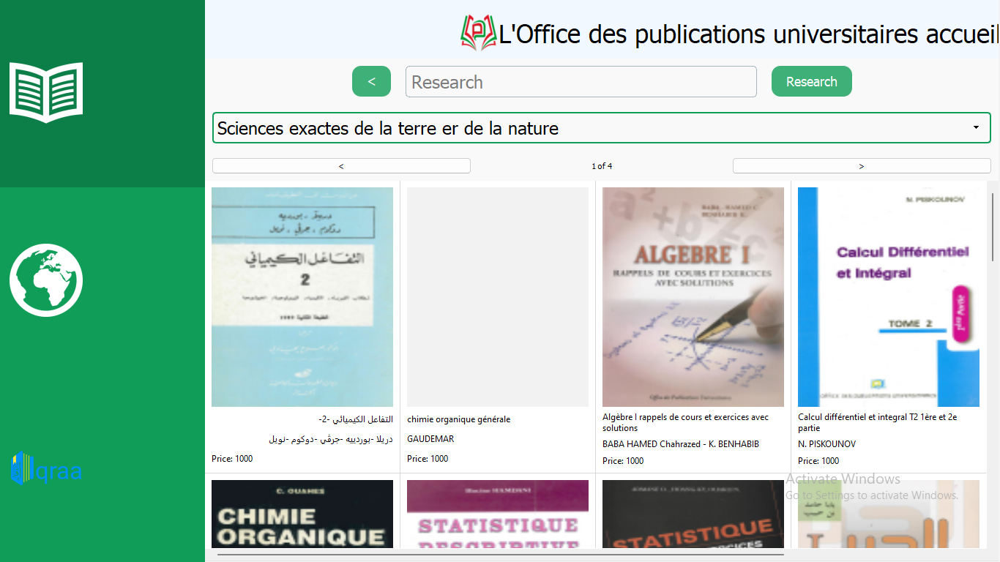

# Opu Catalog
The Book Catalog and Digital Library application is a user-friendly platform designed to showcase a collection of books and provide access to digital versions of those books. The application aims to offer an intuitive and seamless experience for users to explore, search, and interact with books in both physical and digital formats

## Environment

1. Install virtualenv:
```
pip install virtualenv
```
2. Create a virtual environment:
```
python -m  virtualenv env
```

3. Activate the virtual environment:
- On Windows:
  ```
  env\Scripts\activate
  ```
- On macOS and Linux:
  ```
  source env/bin/activate
  ```
## Installation

Install the required packages:
```
pip install -r requirements.txt
```
## Execution

Run the main script:
```
python main.py
```
## Build

Build the project:
```
python setup.py
```
## Installation File
Click [here]() to download the installation file.





